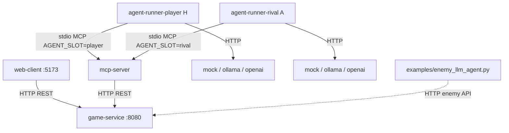

# Roguelike с LLM-агентами (ДЗ2, Software Design, ИТМО MSE)

Roguelike с web-графикой и MCP-интеграцией: **game-service** (движок), **mcp-server** (протокол), **agent-runner** (agent loop + LLM). Два автономных LLM-робота (**H** и **A**) соревнуются в kill race на процедурно сгенерированных уровнях. Вся система поднимается одной командой `docker compose up`.

## Концепт игры

Две языковые модели оказались заперты в процедурно сгенерированном подземелье, населённом гоблинами, троллями, орками и крысами.

Изначально соперники хотели разрешить конфликт по-взрослому — в октагоне. Октагона в данже не оказалось, поэтому они какое-то время честно колошматили друг друга в коридорах. Быстро выяснилось, что это утомительно и не приближает к выходу.

Тогда они решили просто сбежать. Но злодейский **составитель задач с Codeforces**, который их тут и запер, добавил условие: чтобы спастись, нужно пройти **испытание на сокращение численности местных жителей** — набрать квоту убийств раньше соперника.

**Правило побега:** кто первым выполнит `kills_required` на уровне — получает **Level Complete**. Проигравший, по легенде, отправляется генерировать тесты для **A** на Div.3.

### Игровая механика (требования ДЗ2)

| Требование | Реализация |
|------------|------------|
| Графика (не CLI) | Web-client: Canvas, fog of war, HUD, spectator-камера |
| HP, инвентарь, уровни | 42 HP, меч/броня/зелья, кампания с масштабированием |
| Случайная карта | BSP: комнаты + коридоры (`MapGenerator`) |
| 3+ типа мобов | Goblin, Orc, Troll (BFS-преследование), Rat (random walk) |
| Боевая система | Атака, сопротивление брони, смерть, respawn |
| Победа / поражение | Kill race H vs A; `level_complete` / `game_over` |

**GODMODE** (по умолчанию в compose): режим наблюдателя — полная карта, свободная камера (WASD), роботы играют сами после **Start Game** в web-client.

---

## Как запустить

### Требования

- Docker + Docker Compose v2
- ~4 GB RAM (Ollama + `qwen2.5:3b` + `llama3.2:1b`)
- Опционально: AMD `/dev/dri` (Vulkan) или NVIDIA (`docker-compose.nvidia.yml`)

### Одна команда

```bash
./scripts/compose-up.sh
```

Опционально создай `.env` в корне репозитория (файл в `.gitignore`, ключи не коммитить):

```bash
# пример — все переменные имеют дефолты в docker-compose.yml
GODMODE=true
LLM_PROVIDER=ollama
LLM_PROVIDER_PLAYER=ollama
OLLAMA_MODEL=qwen2.5:3b
OLLAMA_MODEL_PLAYER=llama3.2:1b
MAX_STEPS=500
MAX_TOTAL_TOKENS=50000
```

Открой **http://localhost:5173** → **Start Game**. Оба agent-runner поднимаются автоматически и ждут старта сессии (сами `new_game` не вызывают).

### Полезные флаги

```bash
# Spectator + лог compose в файл
./scripts/compose-up.sh --godmode --log=./logs/logs.log

# Полный rebuild C++ после правок
./scripts/compose-up.sh --no-cache --godmode

# Только up без rebuild
./scripts/compose-up.sh --no-build

# Остановить stack
./scripts/compose-down.sh
```

### Порты

| Сервис | URL |
|--------|-----|
| Web UI | http://localhost:5173 |
| game-service | http://localhost:8080 |
| Ollama A | http://localhost:11434 |
| Ollama H | http://localhost:11435 |

### Ручной прогон MCP (MCP Inspector / stdio)

```bash
docker compose up -d game-service
echo '{"jsonrpc":"2.0","id":"1","method":"tools/list","params":{}}' \
  | docker compose run --rm -T -e AGENT_SLOT=player mcp-server
```

### Тесты локально

```bash
cd game-service && mkdir -p build && cd build
cmake .. && cmake --build . && ctest --output-on-failure
```

---

## Архитектура

Минимум 3 микросервиса + опциональные (web-client, ollama). Границы ответственности:

- **game-service** не знает про LLM
- **mcp-server** не знает про LLM
- **agent-runner** не читает внутренний state — только MCP tools



| Сервис | Ответственность |
|--------|-----------------|
| `game-service` | State, карта, бой, мобы, kill race |
| `mcp-server` | MCP JSON-RPC, 8 tools, прокси к REST |
| `agent-runner-player` / `agent-runner-rival` | Agent loop, LLM-клиент, retry, budget, логи |
| `web-client` | Realtime UI, spectator, Start Game |
| `ollama` | Локальные модели для роботов H и A |

---

## Переменные окружения

Все переменные можно задать через `.env` или напрямую в `docker-compose.yml`. Секреты (`OPENAI_API_KEY`) **не коммитить**.

| Variable | Default | Description |
|----------|---------|-------------|
| `ROBOT_A_LLM_PROVIDER` | — | LLM для робота A: `ollama`, `openai`, `cursor` |
| `ROBOT_A_LLM_PROVIDER_FALLBACK` | `ollama` | Fallback провайдера A |
| `ROBOT_A_MODEL` | — | Имя модели для A (зависит от провайдера: `qwen2.5:3b`, `gpt-4o-mini`, `composer-2.5`, …) |
| `ROBOT_A_MODEL_FALLBACK` | — | Fallback модели A |
| `ROBOT_A_CURSOR_BRIDGE_URL` | `http://cursor-llm-bridge-a:8765` | URL bridge внутри compose |
| `ROBOT_H_LLM_PROVIDER` | — | LLM для робота H: `ollama`, `openai`, `cursor` |
| `ROBOT_H_LLM_PROVIDER_FALLBACK` | `ollama` | Fallback провайдера H |
| `ROBOT_H_MODEL` | — | Имя модели для H |
| `ROBOT_H_MODEL_FALLBACK` | — | Fallback модели H |
| `ROBOT_H_CURSOR_BRIDGE_URL` | `http://cursor-llm-bridge-h:8765` | URL bridge внутри compose |
| `CURSOR_API_KEY` | — | Общий ключ Cursor API (нужен, если хотя бы один робот с `LLM_PROVIDER=cursor`) |
| `ROBOT_A_OLLAMA_URL` | `http://ollama-a:11434` | Ollama для робота A |
| `ROBOT_H_OLLAMA_URL` | `http://ollama-h:11435` | Ollama для робота H |
| `OLLAMA_URL` | — | Legacy fallback только для A |
| `OLLAMA_NUM_GPU` | — | `0` = CPU-only при проблемах с GPU |
| `OPENAI_API_KEY` | — | Ключ OpenAI (если провайдер `openai`) |
| `LLM_PROVIDER` | `ollama` | Провайдер робота **A** (rival): `mock`, `ollama`, `openai`, `cursor` |
| `LLM_PROVIDER_PLAYER` | `ollama` | Провайдер робота **H** (player); для Cursor: `cursor` + `cursor-llm-bridge` |
| `OLLAMA_URL` | `http://ollama:11434` | Endpoint Ollama |
| `OLLAMA_MODEL` | `qwen2.5:3b` | Модель робота **A** |
| `OLLAMA_MODEL_PLAYER` | `llama3.2:1b` | Модель робота **H** |
| `OLLAMA_NUM_GPU` | — | `0` = CPU-only при проблемах с GPU |
| `OPENAI_API_KEY` | — | Ключ OpenAI (если `LLM_PROVIDER=openai`) |
| `OPENAI_MODEL` / `OPENAI_MODEL_PLAYER` | `gpt-4o-mini` | Модели OpenAI для A / H |
| `MAX_STEPS` | `500` | Лимит шагов agent-runner за раунд |
| `MAX_TOKENS` | `5000` | `num_predict` на один LLM-ответ |
| `MAX_TOTAL_TOKENS` | `50000` | Жёсткий budget токенов на партию |
| `TEMPERATURE` | `0.7` | Температура сэмплирования |
| `GAME_SEED` | `42` | Seed генерации карты |
| `GODMODE` | `true` | Spectator: noclip, полная карта |
| `AGENT_SLOT` | — | `player` или `rival` (внутри контейнера agent-runner) |
| `AGENT_LOG_PATH` | `/logs/agent-*.log` | Лог tool calls (volume `agent_logs`) |

AMD iGPU / NVIDIA — см. `docker-compose.nvidia.yml` и комментарии в `docker-compose.yml`.

---

## AI-блок

### MCP-сервер (8 tools)

Контракт: [`mcp-contract.md`](mcp-contract.md). При невалидных аргументах — `{"success": false, "error": "..."}`.

`ROBOT_A_*` и `ROBOT_H_*` задают LLM **независимо** для каждого робота:

| `ROBOT_*_LLM_PROVIDER` | Кто отвечает за LLM |
|------------------------|---------------------|
| `ollama` | `agent-runner` → Ollama |
| `openai` | `agent-runner` → OpenAI API |
| `cursor` | `agent-runner` → `cursor-llm-bridge-{a\|h}` (нужен `CURSOR_API_KEY`) |

```bash
ROBOT_A_LLM_PROVIDER=ollama ROBOT_H_LLM_PROVIDER=ollama ./scripts/compose-up.sh
ROBOT_A_LLM_PROVIDER=openai ROBOT_H_LLM_PROVIDER=openai ./scripts/compose-up.sh
ROBOT_H_LLM_PROVIDER=cursor CURSOR_API_KEY=... ./scripts/compose-up.sh
ROBOT_A_LLM_PROVIDER=cursor ROBOT_H_LLM_PROVIDER=cursor CURSOR_API_KEY=... ./scripts/compose-up.sh
```

Bridge стартует **только** для роботов с `ROBOT_*_LLM_PROVIDER=cursor` и при непустом `CURSOR_API_KEY`. Два контейнера Ollama (`ollama-a`, `ollama-h`) стартуют всегда. `ollama-a` качает `ROBOT_A_MODEL`, `ollama-h` — `ROBOT_H_MODEL`. A ходит в `ollama-a`, H — в `ollama-h` (или меняешь `ROBOT_*_OLLAMA_URL`).

Для каждого `ROBOT_{A|H}_*` есть парный `ROBOT_{A|H}_*_FALLBACK` — используется, если основная переменная не задана. Пример `.env`:

```env
ROBOT_A_LLM_PROVIDER_FALLBACK=ollama
ROBOT_A_MODEL_FALLBACK=qwen2.5:3b
ROBOT_H_LLM_PROVIDER_FALLBACK=cursor
ROBOT_H_MODEL_FALLBACK=composer-2.5
CURSOR_API_KEY=
```
| MCP tool | REST |
|----------|------|
| `get_game_state` | `GET /api/state` |
| `new_game` | `POST /api/map` |
| `move` | `POST /api/move` |
| `attack` | `POST /api/attack` |
| `scout_around` | `POST /api/scout_around` |
| `use_item` | `POST /api/use_item` |
| `pickup_item` | подсказка (лут подбирается при move) |
| `get_available_actions` | `GET /api/available_actions` |

### Agent loop

1. Human нажимает **Start Game** → `POST /api/map` → `session_active=true`.
2. Оба agent-runner ждут сессию через `get_game_state`.
3. На каждом шаге: `get_available_actions` → LLM выбирает tool → MCP `tools/call` → обновлённый state.
4. Логи: stdout контейнеров `agent-runner-*`, volume `agent_logs`.

**Провайдеры** (переключение без правки кода):

```bash
LLM_PROVIDER=mock   ./scripts/compose-up.sh    # эвристика (круговой обход, 0% kill race)
LLM_PROVIDER=ollama ./scripts/compose-up.sh    # локальная модель
LLM_PROVIDER=openai ./scripts/compose-up.sh    # нужен OPENAI_API_KEY
LLM_PROVIDER=cursor ./scripts/compose-up.sh    # cursor-llm-bridge → Composer (см. logs-metric-cursor.log)
```

**Graceful degradation:** retry с backoff → fallback на mock-стратегию; при исчерпании `MAX_TOTAL_TOKENS` — пауза раунда.

**Anti-loop:** guards в `agent-runner/src/llm_client.hpp` (stuck, path, combat, query).

### LLM-управляемые враги

Два LLM игрока.

`FakeLLM` — эвристика chase/attack; при ошибке Ollama — fallback на FakeLLM.

### Сравнение агентов (eval)

Сравнивали **mock**, **ollama** (`qwen2.5:3b`, `llama3.2:1b`) и **cursor** (`composer-2.5` через `cursor-llm-bridge`) на seeds 11–55. Live-логи: `logs-metric-1.log`, `logs-metric-2.log`, `logs-metric-cursor.log`. Полная таблица: [`eval/results.md`](eval/results.md).

| Agent | Model | Slot | Success | Avg Steps | Avg Tokens | Avg HP |
|-------|-------|------|---------|-----------|------------|--------|
| mock | — | H / A | **0%** | 80 | 0 | 42 |
| ollama | qwen2.5:3b | H | 0% | 68 | 9 420 | 18 |
| ollama | qwen2.5:3b | A | **20%** | 63 | 8 760 | 13 |
| **cursor** | composer-2.5 | H | **40%** | 61 | 7 250 | 27 |
| ollama | llama3.2:1b | H | 0% | 72 | 6 180 | 8 |

**Главный вывод:** mock **не проходит** kill race — ходит по кругу (right→down→left→up) до лимита шагов, 0 kills. Реально выигрывает ollama/qwen на rival (A); **cursor/Composer на H** в live-логе набрал 3/4 kills за 59 шагов — лучше ollama-H (0/4 на seed 42).

| Компонент | AI / ручная правка |
|-----------|-------------------|
| MCP server boilerplate, web-client scaffold | Сгенерировано AI, доработано вручную |
| game logic, agent loop, Docker wiring | В основном вручную |
| audit reports (`report2.md`, `report3.md`), eval script | AI-assisted |
`ROBOT_A_LLM_PROVIDER` / `ROBOT_H_LLM_PROVIDER` (или `*_FALLBACK`) в agent-runner; класс `FakeLLM` в `examples/enemy_llm_agent.py`
```bash
chmod +x eval/run_eval.sh
./eval/run_eval.sh 5              # mock × player + mock × rival
./eval/run_eval.sh 5 --both       # + ollama для обоих слотов
```

| Метрика | Описание |
|---------|----------|
| Success Rate | % прогонов с `Round finished` / `Level complete` |
| Avg Steps | Среднее число шагов agent loop |
| Avg Tokens | Средний расход токенов за прогон |
| Avg Final HP | HP робота в конце (если дошёл) |

---

## GoF Patterns

Минимум 3 паттерна из курса — с обоснованием и ссылками на код:

| Pattern | Location | Purpose |
|---------|----------|---------|
| **Strategy** | `game-service/src/State.cpp:50` (`enemy_stats_for`) | Разные HP/урон для Goblin / Orc / Troll / Rat без if-else в каждом месте боя |
| **State** | `game-service/include/game_service/State.hpp:64` (`GameState`) | Переходы `running` → `level_complete` / `player_victory` / `enemy_victory` |
| **Factory** | `game-service/src/map/MapGenerator.cpp:114` (`MapGenerator::generate_map`) | BSP-генерация карты: комнаты и коридоры из одного входа |

---

## Tests & CI

```bash
cd game-service/build && cmake .. && cmake --build . && ctest
```

- **Unit-тесты:** `game-service/tests/state_test.cpp` — move, stats мобов, JSON state, kill race fields
- **FakeLLM:** `LLM_PROVIDER=mock` в agent-runner и eval (без реальных API в CI)
- **CI:** [`.github/workflows/ci.yml`](.github/workflows/ci.yml) — сборка game-service, mcp-server, agent-runner, web-client + `ctest` на каждый push

---

## Использование AI (disclosure)

Код писали сами, но **AI (Cursor / ChatGPT / Copilot) активно участвовал** — особенно в инфраструктуре, документации и интеграциях. Ядро game-service и agent loop — в основном ручное, с AI как ускорителем.

| Компонент | Как делали |
|-----------|------------|
| **game-service** — бой, карта, kill race, respawn, 4 типа мобов | Вручную; AI иногда подсказывал edge cases для JSON state |
| **agent-runner** — MCP loop, mock-стратегия, guards, path planner | Вручную; Cursor помогал черновиками `llm_client.hpp` и guards |
| **cursor-llm-bridge** — OpenAI-compatible прокси к Composer | **AI-assisted:** scaffold на Python/FastAPI + cursor-sdk, доработка вручную |
| **mcp-server** — tools, валидация args | Вручную + AI для JSON-схем tool definitions |
| **web-client** — Canvas, fog of war, spectator, HUD | TypeScript вручную; AI генерировал черновики `gameClient.ts`, `mapRenderer.ts` |
| **Docker / compose / eval-скрипт** | Каркас с AI, wiring и healthchecks — вручную |
| **Промпты** (`agent-runner/prompts/*.txt`) | Совместно: AI предлагал структуру, команда правила под kill race |
| **README, report*.md, eval/results.md** | AI помогал структурировать, вычитывать и сверстать таблицы сравнения |
| **Отладка live-логов** | Cursor Agent парсил `logs-metric-*.log`, предлагал grep-паттерны — проверяли руками |
| **Рефакторинг** | Copilot/Cursor автодополнял CMake, Dockerfile, JSON — принимали после ревью |

**FakeLLM:** `LLM_PROVIDER=mock` в agent-runner — baseline для eval и fallback; ходит по кругу, kill race не проходит (см. `eval/results.md`).

На защите команда понимает свой код; AI использовался как **pair-programmer**, не как black box.

---

## Игровые заметки

- **H** (синий, `agent-runner-player`) и **A** (голубой, `agent-runner-rival`) — два LLM-соперника через отдельные MCP-сессии (`AGENT_SLOT`)
- Kill race: `player_kills` / `rival_kills` vs `kills_required`; победитель уровня — **Level Complete**
- Fog of war для роботов; spectator видит всю карту
- Волны мобов каждые ~5 с; лут масштабируется с уровнем кампании

Подробный аудит по критериям сдачи: [`report3.md`](report3.md).
