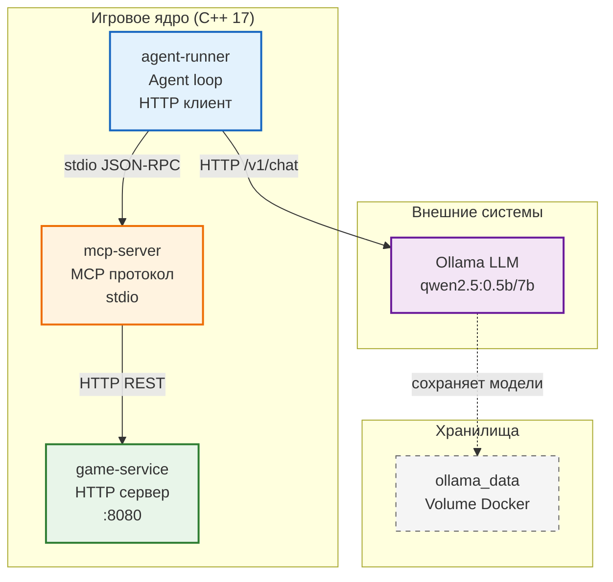

# game_with_llm_sd_project_2_blin_super_kruto_bimbim_bambam

Roguelike игра с LLM-агентом, реализованная на C++ в микросервисной архитектуре с MCP протоколом.

## Требования курса

- **Архитектура**: 3+ микросервиса (game-service, mcp-server, agent-runner, ollama)
- **Игровая часть**: Графика, случайная генерация карты, 3+ типа мобов, боевая система, инвентарь
- **AI блок**: MCP сервер с 5+ tools, agent loop с LLM, LLM-управляемые враги
- **Качество**: Юнит-тесты, CI, README, защита

## Архитектура


## Технологии

  - C++17
  - CMake
  - Docker + Docker Compose
  - Ollama (qwen2.5)
  - nlohmann/json
  - libcurl
  - MCP Protocol

## Быстрый старт
  ### 1. Запуск проекта
  ```bash
  docker compose up --build
  ```

  ### 2. Переменные окружения
  ```bash
  cp .env.example .env
  ```
  ### Основные настройки:
  - LLM_PROVIDER=mock (по умолчанию) или ollama
  - MAX_STEPS=50

## MCP-контракт

  Подробно расписано в mcp-contract.md
