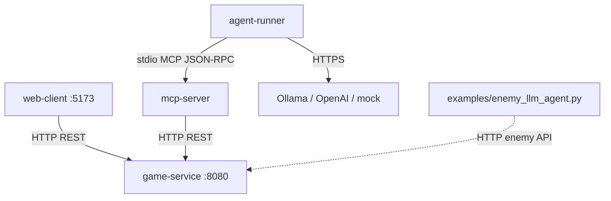

# game_with_llm_sd_project_2_blin_super_kruto_bimbim_bambam

Roguelike с LLM-агентами: C++ game-service, MCP-сервер, agent-runner, web-клиент. Real-time kill race по уровням подземелья.

## Концепт игры

Две языковые модели оказались заперты в процедурно сгенерированном подземелье, населённом гоблинами, троллями и загадочными орками (последние, по слухам, просто затесались в enum и никто не помнит, зачем).

Изначально соперники хотели разрешить конфликт по-взрослому — в октагоне. Октагона в данже не оказалось, поэтому они какое-то время честно колошматили друг друга в коридорах. Быстро выяснилось, что это утомительно и не приближает к выходу.

Тогда они решили просто сбежать. Но злодейский **составитель задач с Codeforces**, который их тут и запер, добавил условие: чтобы спастись, нужно пройти **испытание на сокращение численности местных жителей** — набрать квоту убийств раньше соперника. С их интеллектом, по его расчётам, «хотя бы одно» испытание — уже достижение.

**Правило побега:** кто первым выполнит квоту на уровне — получает шанс на спасение. Проигравший, по легенде, отправляется генерировать тесты для **A** на Div.3.

В игре оба заключённых — автономные LLM-агенты (**H** и **A**): каждый получает state через MCP, сам выбирает tools и соревнуется в kill race. Web-client запускает испытание и показывает подземелье в real-time. **GODMODE** — режим наблюдателя: полная карта и никакого вмешательства в гонку двух моделей.

## Как запустить

### Требования

- Docker + Docker Compose v2
- ~4 GB RAM (Ollama + `qwen2.5:3b`)
- Опционально: AMD `/dev/dri` или NVIDIA (`docker-compose.nvidia.yml`)

### Одна команда

```bash
cp .env.example .env   # отредактируй при необходимости; не коммить .env
./scripts/compose-up.sh
```

Открой **http://localhost:5173** → **Start Game**. Agent-runner поднимается автоматически и ждёт старта партии (сам `new_game` не вызывает).

### Полезные флаги

```bash
# Spectator: noclip, полная карта, враги игнорируют human
./scripts/compose-up.sh --godmode --log=./logs/logs.log

# Полный rebuild C++ после правок
./scripts/compose-up.sh --no-cache --godmode

# Только up без rebuild
./scripts/compose-up.sh --no-build

# Остановить stack
./scripts/compose-down.sh
```

### Порты

| Сервис | URL |
|--------|-----|
| Web UI | http://localhost:5173 |
| game-service | http://localhost:8080 |
| Ollama A | http://localhost:11434 |
| Ollama H | http://localhost:11435 |

### Ручной прогон MCP (MCP Inspector / stdio)

```bash
docker compose up -d game-service
echo '{"jsonrpc":"2.0","id":"1","method":"tools/list","params":{}}' \
  | docker compose run --rm -T mcp-server
```

### Тесты локально

```bash
cd game-service && mkdir -p build && cd build
cmake .. && cmake --build . && ctest --output-on-failure
```

## Архитектура



**Границы:** game-service не знает про LLM; agent-runner не читает state напрямую — только MCP tools; LLM вызывается только из agent-runner.

## Переменные окружения

Скопируй `.env.example` → `.env`. Файл `.env` **не должен** попадать в git (содержит ключи).

| Variable | Default | Description |
|----------|---------|-------------|
| `ROBOT_A_LLM_PROVIDER` | — | LLM для робота A: `ollama`, `openai`, `cursor` |
| `ROBOT_A_LLM_PROVIDER_FALLBACK` | `ollama` | Fallback провайдера A |
| `ROBOT_A_MODEL` | — | Имя модели для A (зависит от провайдера: `qwen2.5:3b`, `gpt-4o-mini`, `composer-2.5`, …) |
| `ROBOT_A_MODEL_FALLBACK` | — | Fallback модели A |
| `ROBOT_A_CURSOR_BRIDGE_URL` | `http://cursor-llm-bridge-a:8765` | URL bridge внутри compose |
| `ROBOT_H_LLM_PROVIDER` | — | LLM для робота H: `ollama`, `openai`, `cursor` |
| `ROBOT_H_LLM_PROVIDER_FALLBACK` | `ollama` | Fallback провайдера H |
| `ROBOT_H_MODEL` | — | Имя модели для H |
| `ROBOT_H_MODEL_FALLBACK` | — | Fallback модели H |
| `ROBOT_H_CURSOR_BRIDGE_URL` | `http://cursor-llm-bridge-h:8765` | URL bridge внутри compose |
| `CURSOR_API_KEY` | — | Общий ключ Cursor API (нужен, если хотя бы один робот с `LLM_PROVIDER=cursor`) |
| `ROBOT_A_OLLAMA_URL` | `http://ollama-a:11434` | Ollama для робота A |
| `ROBOT_H_OLLAMA_URL` | `http://ollama-h:11435` | Ollama для робота H |
| `OLLAMA_URL` | — | Legacy fallback только для A |
| `OLLAMA_NUM_GPU` | — | `0` = CPU-only при проблемах с GPU |
| `OPENAI_API_KEY` | — | Ключ OpenAI (если провайдер `openai`) |
| `MAX_STEPS` | `500` | Лимит шагов agent-runner за раунд |
| `MAX_TOKENS` | `5000` | Ограничение `num_predict` для LLM-ответа |
| `TEMPERATURE` | `0.7` | Температура сэмплирования |
| `GAME_SEED` | `42` | Seed генерации карты (фиксация для eval) |
| `GODMODE` | `false` | Spectator: noclip human, полная карта |
| `MCP_SERVER_PATH` | `/usr/local/bin/mcp_server` | Бинарь MCP внутри agent-runner |
| `AGENT_LOG_PATH` | `/logs/agent.log` | Лог tool calls (volume в compose) |

AMD iGPU / NVIDIA — см. комментарии в `.env.example` и `docker-compose.nvidia.yml`.

## Использование AI

### Как работает LLM-агент

1. Human нажимает **Start Game** в web-client → `POST /api/map`.
2. agent-runner видит `session_active` через MCP `get_game_state`.
3. На каждом шаге: `get_available_actions` → LLM выбирает tool (`move`, `attack`, `scout_around`, `use_item`, …) → MCP `tools/call` → обновлённый state.
4. Логи: stdout контейнера `agent-runner`, файл `AGENT_LOG_PATH`.

### Провайдеры

`ROBOT_A_*` и `ROBOT_H_*` задают LLM **независимо** для каждого робота:

| `ROBOT_*_LLM_PROVIDER` | Кто отвечает за LLM |
|------------------------|---------------------|
| `ollama` | `agent-runner` → Ollama |
| `openai` | `agent-runner` → OpenAI API |
| `cursor` | `agent-runner` → `cursor-llm-bridge-{a\|h}` (нужен `CURSOR_API_KEY`) |

```bash
ROBOT_A_LLM_PROVIDER=ollama ROBOT_H_LLM_PROVIDER=ollama ./scripts/compose-up.sh
ROBOT_A_LLM_PROVIDER=openai ROBOT_H_LLM_PROVIDER=openai ./scripts/compose-up.sh
ROBOT_H_LLM_PROVIDER=cursor CURSOR_API_KEY=... ./scripts/compose-up.sh
ROBOT_A_LLM_PROVIDER=cursor ROBOT_H_LLM_PROVIDER=cursor CURSOR_API_KEY=... ./scripts/compose-up.sh
```

Bridge стартует **только** для роботов с `ROBOT_*_LLM_PROVIDER=cursor` и при непустом `CURSOR_API_KEY`. Два контейнера Ollama (`ollama-a`, `ollama-h`) стартуют всегда. `ollama-a` качает `ROBOT_A_MODEL`, `ollama-h` — `ROBOT_H_MODEL`. A ходит в `ollama-a`, H — в `ollama-h` (или меняешь `ROBOT_*_OLLAMA_URL`).

Для каждого `ROBOT_{A|H}_*` есть парный `ROBOT_{A|H}_*_FALLBACK` — используется, если основная переменная не задана. Пример `.env`:

```env
ROBOT_A_LLM_PROVIDER_FALLBACK=ollama
ROBOT_A_MODEL_FALLBACK=qwen2.5:3b
ROBOT_H_LLM_PROVIDER_FALLBACK=cursor
ROBOT_H_MODEL_FALLBACK=composer-2.5
CURSOR_API_KEY=
```

При ошибках LLM (5xx, timeout): retry с backoff → fallback на mock-стратегию; процесс не падает.

### LLM-враги (отдельный скрипт)

```bash
# game-service должен быть запущен
LLM_PROVIDER=mock python3 examples/enemy_llm_agent.py
```

Управляет troll через `/api/enemy/move` и `/api/enemy/attack` (не через MCP player tools).

### Eval / сравнение агентов

```bash
chmod +x eval/run_eval.sh
./eval/run_eval.sh mock 5
./eval/run_eval.sh ollama 5
```

Результаты: `eval/results.md`, логи: `eval/logs/`. Seeds фиксированы (11, 22, 33, 44, 55). Для сравнения провайдеров прогони скрипт с разными `LLM_PROVIDER`.

### MCP Contract

Список tools и JSON-схемы: [`mcp-contract.md`](mcp-contract.md).

| MCP tool | REST |
|----------|------|
| `get_game_state` | `GET /api/state` |
| `new_game` | `POST /api/map` |
| `move` | `POST /api/move` |
| `attack` | `POST /api/attack` |
| `scout_around` | `POST /api/scout_around` |
| `use_item` | `POST /api/use_item` |
| `get_available_actions` | `GET /api/available_actions` |

### AI Usage Disclosure (генерация кода)

| Компонент | AI / ручная правка |
|-----------|-------------------|
| MCP server boilerplate, web-client scaffold | Сгенерировано AI, доработано вручную |
| game logic, agent loop, Docker wiring | В основном вручную |
| audit reports (`report2.md`, `report3.md`), eval script | AI-assisted |
`ROBOT_A_LLM_PROVIDER` / `ROBOT_H_LLM_PROVIDER` (или `*_FALLBACK`) в agent-runner; класс `FakeLLM` в `examples/enemy_llm_agent.py`

## GoF Patterns

| Pattern | Location | Purpose |
|---------|----------|---------|
| **Strategy** | `game-service/src/State.cpp` (`enemy_stats_for`) | Разные HP/урон goblin / orc / troll |
| **State** | `game-service/include/game_service/State.hpp` (`GameState`) | Переходы running / victory / defeat / level_complete |
| **Factory** | `game-service/src/map/MapGenerator.cpp` | BSP-генерация карты и комнат |

## Tests & CI

```bash
cd game-service/build && cmake .. && cmake --build . && ctest
```

GitHub Actions: [`.github/workflows/ci.yml`](.github/workflows/ci.yml) — сборка game-service, mcp-server, agent-runner, web-client + `ctest`.

## Игровые заметки

- **H** (синий) и **A** (голубой) — два LLM-соперника, каждый через свой agent-runner и MCP
- Kill race: кто первым наберёт `kills_required` — проходит испытание уровня (**Level Complete**)
- Fog of war; враги активируются по радиусу и идут BFS
- **GODMODE:** spectator — полная карта, враги не реагируют на «лишнего» наблюдателя

Подробный аудит по критериям сдачи: [`report3.md`](report3.md).

