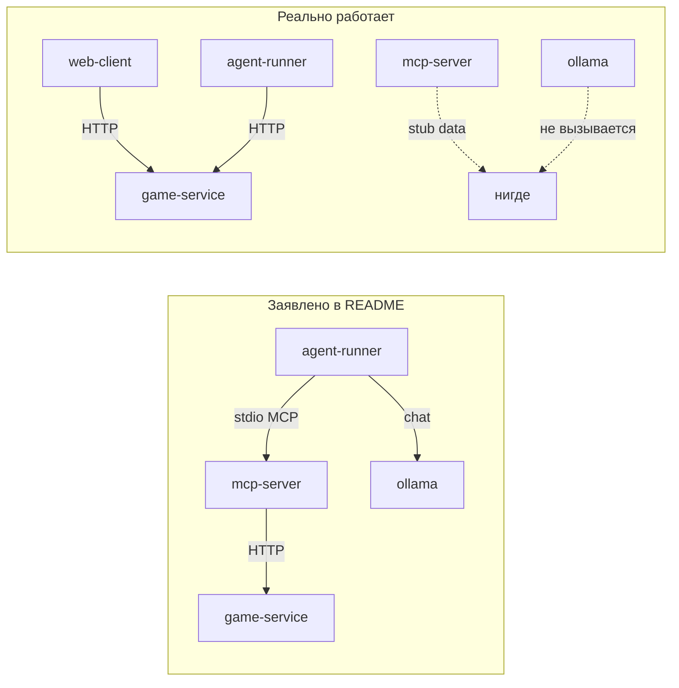

# Отчёт по проекту: Roguelike + LLM + MCP

**Репозиторий:** `game_with_llm_sd_project_2_blin_super_kruto_bimbim_bambam`  
**Ветка:** `feature/game_server`  
**Дата:** 9 июня 2026

---

## 1. Что это за проект

Курсовой roguelike на C++17 в «микросервисной» архитектуре:

| Компонент | Роль | Статус |
|-----------|------|--------|
| **game-service** | HTTP API (:8080), игровая логика | Рабочее ядро |
| **mcp-server** | MCP JSON-RPC over stdio, 7 tools | Заглушки, без связи с game-service |
| **agent-runner** | «AI-агент» | Ходит по кругу, без LLM и MCP |
| **ollama** | LLM (qwen2.5) | Поднимается в Docker, но не используется |
| **web-client** | Vite/TS браузерный клиент | Работает отдельно, не в docker-compose |

**Заявленная схема:** `agent-runner → (stdio) mcp-server → (HTTP) game-service`, плюс `agent-runner → ollama`.

**Фактически:** web-client и agent-runner ходят напрямую в game-service по HTTP. MCP и Ollama в пайплайне не участвуют.

---

## 2. Архитектура (как задумано vs как есть)



---

## 3. Что реализовано хорошо

### game-service — основной рабочий сервис

- REST API по контракту из `mcp-contract.md`: `/api/state`, `/api/move`, `/api/attack`, `/api/pickup_item`, `/api/use_item`, `/api/visible_cells`, `/api/available_actions`, `POST/GET /api/map`, `/health`.
- **Генерация карты:** BSP (Binary Space Partitioning) — комнаты, коридоры, seed.
- **Боевая система:** атака по соседней клетке, урон базовый 5, дроп лута, золото за убийство.
- **Ходы:** `player_turn` → `enemy_turn` → `player_turn`; враги атакуют вплотную (2 урона) или идут к игроку в радиусе 6.
- **Система лута:** 3 типа + 10% ничего (Potion 40%, Sword 15%, Armor 35%, Nothing 10%), доступна только герою.
- **Инвентарь:** подбор и использование предметов с пассивными и активными эффектами. **Пассивные:** Меч (+2 урона), Броня (+20% сопротивления, макс +66% всего). **Активные:** Зелья (+20 HP, потребляемые). Макс урона: +4.
- **Fog of war:** круговая видимость в `get_visible_cells`.

### web-client

- Canvas-рендер, fog of war, HUD (HP, gold, инвентарь), WASD/клики.
- Типизированный REST-клиент, прокси Vite на `:8080`.
- Схема `player.x/y` совпадает с бэкендом (в отличие от agent-runner).

### mcp-server (инфраструктура)

- JSON-RPC: `initialize`, `tools/list`, `tools/call`.
- 7 tools зарегистрированы — по числу требований курса хватает.

---

## 4. Критические проблемы

### 4.1 MCP-сервер — полностью заглушка

`mcp-server/src/main.cpp` возвращает **фиктивные данные**, HTTP к game-service **нет**:

```cpp
server.register_tool("get_game_state", ...,
    [](const json&) -> json {
        return {{"player", {{"hp", 100}, {"pos", {5, 10}}}, {"game_over", false}}};
    });
```

Контракт в `mcp-contract.md` говорит о проксировании на `http://game-service:8080` — **не реализовано**.

### 4.2 agent-runner не агент и не использует LLM/MCP

- `LLMClient` создаётся, но **`chat()` никогда не вызывается**.
- Нет stdio-связи с mcp-server (в docker-compose контейнеры изолированы).
- Стратегия: `right → down → left → up` по кругу.

**Баг — несовместимость JSON-схемы:**

```cpp
// agent-runner/src/main.cpp
std::cout << "Position: [" << state["player"]["pos"][0] << ", "
          << state["player"]["pos"][1] << "]" << std::endl;
```

game-service отдаёт `player.x` / `player.y`, поля `pos` нет → вероятный `json::type_error` и падение на первом шаге.

### 4.3 LLMClient — только mock

```cpp
// agent-runner/src/llm_client.hpp
std::optional<std::string> chat(...) {
    if (use_mock_) {
        return "{\"action\": \"move\", \"direction\": \"right\"}";
    }
    return std::nullopt;  // ollama не реализован
}
```

При `LLM_PROVIDER=ollama` (как в `.env.example`) — `nullopt`, интеграции с Ollama **нет**.

### 4.4 Docker Compose не связывает сервисы по заявленной схеме

- `agent-runner` не pipe'ится в `mcp-server` через stdio.
- `LLM_PROVIDER=mock` захардкожен в compose, `.env` не подключён.
- `web-client` не в compose.
- Ollama тянет модель при старте (~сотни MB), но **ни один сервис к ней не обращается**.

---

## 5. Баги и недоделки в game-service

| Проблема | Детали |
|----------|--------|
| **Victory никогда не наступает** | `Phase::Victory` есть в enum, но нигде не выставляется. `won` всегда `false`. |
| **`start_new_game` не сбрасывает состояние** | Не очищаются `enemies`, `dropped_loot`, `player.inventory`; `steps` не обнуляется. Повторный `POST /api/map` — накопление врагов и лута. |
| **`steps` не инициализирован** | В конструкторе `State` поле `steps` не задано → UB при первом чтении. |
| **Меч бесполезен** | ❌ Удалено — `use_item` обрабатывает только активные эффекты (`active_effect == "heal"`); меч имеет пассивный эффект и работает автоматически. |
| **LLM-враги** | Простой chase-AI, не LLM (расхождение с README). |
| **Старт без карты** | До `POST /api/map` карта пустая (0×0), move/attack бессмысленны. |

### Сброс состояния при новой игре

В `State::start_new_game` вызывается `entity_grid.assign(...)`, но **`enemies.clear()` и `dropped_loot.clear()` отсутствуют** — при повторном старте игры старые сущности накапливаются.

---

## 6. web-client: мелочи

- **Corridors:** TS-тип `{x1,y1,x2,y2}`, бэкенд шлёт `Rect {x,y,w,h}` — тип не совпадает (на рендер не влияет, corridors не рисуются).
- **CORS:** только через Vite proxy; прямой доступ к `:8080` без CORS-заголовков упадёт.
- **Victory UI** есть, но бэкенд victory не выдаёт.

---

## 7. Соответствие требованиям курса

| Требование | Статус | Комментарий |
|------------|--------|-------------|
| 3+ микросервиса | ⚠️ Частично | 4 контейнера, но не интегрированы |
| Графика | ✅ | web-client |
| Случайная карта | ✅ | BSP |
| 3+ типа мобов | ❌ | Только goblin |
| Боевая система | ✅ | Базовая |
| **Инвентарь** | ✅ | Пассивные (меч, броня) + активные (зелья) с ограничениями (+4 урона, +66% сопротивления). |
| MCP 5+ tools | ⚠️ | 7 tools, все stub |
| Agent loop + LLM | ❌ | Нет |
| LLM-враги | ❌ | Простой AI |
| Юнит-тесты | ❌ | Нет |
| CI | ❌ | Нет `.github/workflows` |
| README | ✅ | Описывает целевое, не фактическое |

**Оценка готовности к защите:** game-service + web-client — playable demo; AI/MCP блок — в основном на бумаге.

---

## 8. Git-история

```
813f338 bug fixes
e159333 Added client
4bb32a2 Game Server
17cf43f Fix typo in README.md
13fe244 First CheckPoint
ce3d8ca first commit
```

Активная разработка на `game-service` и `web-client`; MCP/agent-runner — scaffold с First CheckPoint.

---

## 9. Приоритетный план доработок

### P0 — чтобы система соответствовала README

1. **mcp-server:** libcurl → проксировать все 7 tools на game-service.
2. **agent-runner:** stdio к mcp-server; agent loop: state → LLM → tool call → repeat.
3. **LLMClient:** реальный Ollama `/api/chat` (или OpenAI из `.env.example`).
4. **agent-runner:** читать `player.x/y`, не `pos`.
5. **docker-compose:** связать agent-runner ↔ mcp-server (pipe / supervisor).

### P1 — game-service

6. ✅ Система пассивных/активных предметов (завершено).
7. ✅ Дроп 3 типов лута только для героя (завершено).
8. `start_new_game`: clear `enemies`, `dropped_loot`, inventory, `steps = 0`.
9. Инициализировать `steps` в конструкторе.
10. Условие победы (выход / убить всех / дойти до комнаты).
11. Спавн Orc/Troll с разным HP/уроном.

### P2 — качество

12. Юнит-тесты (State, MapGenerator) — GoogleTest/Catch2.
13. GitHub Actions: build + test.
14. web-client в docker-compose или nginx static.
15. Привести README к фактическому состоянию.

---

## 10. Как запустить то, что работает

```bash
# Бэкенд
docker compose up --build game-service

# Клиент (отдельно)
cd web-client && npm install && npm run dev
# → http://localhost:5173
```

**Не запускать agent-runner** до фикса `player.pos` — упадёт.

---

## 11. Итог

**Сильная сторона:** game-service и web-client — связный playable roguelike с генерацией карты, боем, инвентарём и REST API по контракту.

**Главный разрыв:** README и `mcp-contract.md` описывают LLM + MCP пайплайн, а **mcp-server, agent-runner и ollama не связаны** с игрой. MCP-tools — заглушки, агент — тупой цикл по HTTP, LLM не вызывается.

Для защиты: либо **доделать интеграцию** (P0), либо **честно описать** текущий scope (game-service + web-client, AI — WIP).
