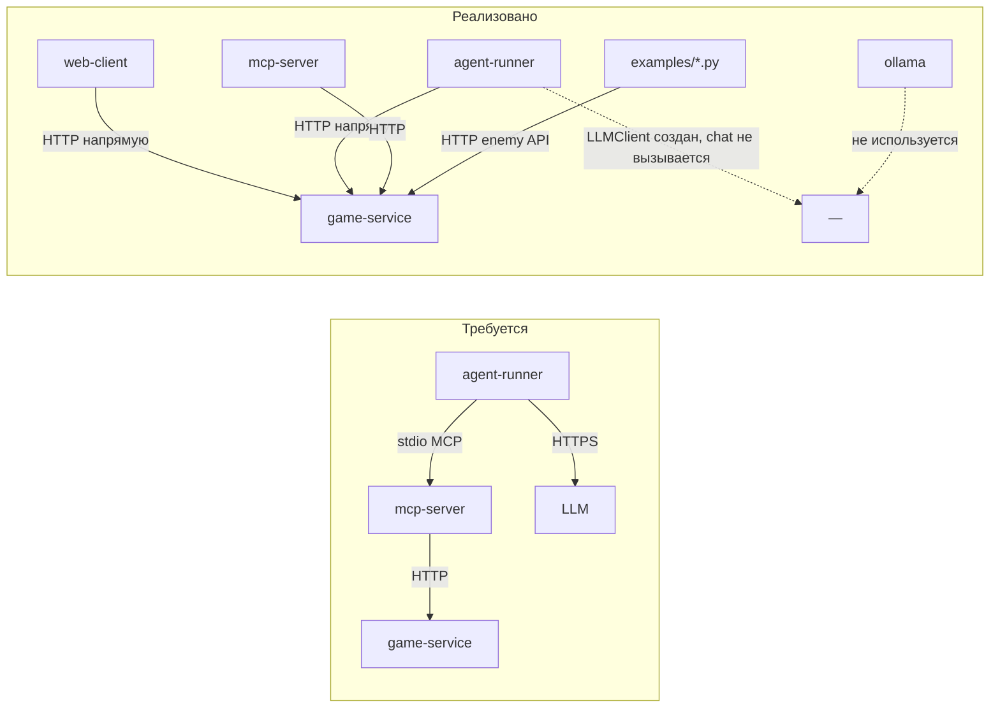

# Аудит проекта по требованиям ДЗ2 (hw2_task.pdf)

**Репозиторий:** `game_with_llm_sd_project_2_blin_super_kruto_bimbim_bambam`  
**Ветка:** `feature/game_server_report`  
**Коммит:** `30ae4e8` (Code audit)  
**Дата аудита:** 14 июня 2026  
**Основание:** `hw2_task.pdf`, `mcp-contract.md`, `report.md`, runtime-проверки

---

## 1. Резюме

| Область | Оценка | Комментарий |
|---------|--------|-------------|
| Игровое ядро (game-service) | **7/10** | Рабочий roguelike: карта BSP, бой, инвентарь, победа/поражение |
| Графика (web-client) | **4/10** | Canvas-клиент есть, но **сломан** из-за расхождения JSON-схемы с бэкендом |
| MCP-сервер | **6/10** | 7 tools, проксирование на game-service работает; валидация аргументов слабая |
| Agent-runner + LLM | **1/10** | Обходит MCP, LLM не вызывается, нет agent loop |
| LLM-враги | **0/10** | Не реализованы |
| Сравнение агентов / eval | **0/10** | Нет `eval/`, скриптов, `results.md` |
| Качество (тесты, CI) | **0/10** | Нет юнит-тестов, нет GitHub Actions |
| GoF-паттерны | **0/10** | Не описаны в README |
| Docker Compose (one command) | **3/10** | 4 контейнера поднимаются, но пайплайн не связан, web-client вне compose |

**Общая готовность к финальной сдаче (10.06): ~25–30%**  
**Playable demo:** game-service по HTTP; web-client и AI-пайплайн требуют доработки.

---

## 2. Архитектура: требование vs реальность

### Требование (hw2_task.pdf)

```
agent-runner ──stdio MCP──▶ mcp-server ──HTTP──▶ game-service
       │
       └──HTTPS──▶ LLM provider
```

Границы: game-service не знает про LLM; mcp-server не знает про LLM; agent-runner не знает внутренний state — только MCP tools.  
Деплой: `docker compose up` без ручных шагов.

### Фактически



| Нарушение границ | Статус |
|------------------|--------|
| agent-runner → game-service напрямую | **Да** — антипаттерн «читы агенту» |
| agent-runner → mcp-server stdio | **Нет** — контейнеры изолированы |
| LLM в agent loop | **Нет** |
| web-client в docker compose | **Нет** — ручной `npm run dev` |
| Ollama используется | **Нет** — контейнер качает модель (~сотни MB) впустую |

---

## 3. Матрица соответствия требованиям hw2_task.pdf

### 3.1. Игра

| Требование | Статус | Доказательство / замечание |
|------------|--------|---------------------------|
| Графика (не CLI) | ⚠️ | `web-client/` — Canvas + HUD; **управление заблокировано** (см. §5.3) |
| Герой: HP, инвентарь, **уровни** | ⚠️ | HP + инвентарь ✅; **уровней нет** |
| Случайная карта (комнаты + коридоры) | ✅ | BSP в `MapGenerator.cpp` |
| 3+ типа мобов с **разным поведением** | ❌ | Enum `Goblin/Orc/Troll`, но все: HP=10, урон=2, одинаковая логика |
| Боевая система | ✅ | Атака, сопротивление, смерть, дроп лута |
| Условие победы / проигрыша | ⚠️ | `PlayerVictory` / `EnemyVictory` в коде; **JSON-контракт не совпадает** с клиентом |

### 3.2. Архитектура (3+ микросервиса)

| Требование | Статус | Комментарий |
|------------|--------|-------------|
| game-service | ✅ | HTTP :8080, игровая логика |
| mcp-server | ⚠️ | JSON-RPC + 7 tools, HTTP-прокси (**исправлено** с report.md) |
| agent-runner | ❌ | Hardcoded цикл move, HTTP к game-service |
| docker compose up | ⚠️ | Сервисы стартуют, но **не интегрированы** в целевой пайплайн |
| Одна команда без ручных шагов | ❌ | web-client отдельно; agent не через MCP |

### 3.3. GoF-паттерны (минимум 3)

| Требование | Статус |
|------------|--------|
| 3+ паттерна с file:line в README | ❌ **Не описано** |

Потенциальные кандидаты (не задокументированы): BSP-генератор (`MapGenerator`), enum-serialization, но формального раздела в README нет.

### 3.4. AI-блок

| Требование | Статус | Комментарий |
|------------|--------|-------------|
| MCP 5+ tools | ✅ | 7 tools в `mcp-server/src/main.cpp` |
| MCP-контракт в репо | ✅ | `mcp-contract.md` |
| Ошибки при невалидных аргументах | ❌ | Segfault при `move` без `direction` (exit 139); invalid direction → `success:false`, не MCP error |
| Agent loop через MCP | ❌ | agent-runner не подключается к mcp-server |
| 2+ LLM-провайдера через env | ❌ | `LLMClient` — mock или `nullopt`; Ollama/OpenAI не реализованы |
| Budget (шаги/токены) | ⚠️ | `MAX_STEPS=10` в compose; токены не считаются |
| Graceful degradation LLM | ❌ | Нет retry/backoff/fallback |
| LLM-управляемые враги | ❌ | `examples/enemy_team_agent_example.py` — if/else chase, не LLM |
| 2+ агента, 5+ прогонов, метрики | ❌ | Нет eval-инфраструктуры |
| `eval/results.md` | ❌ | Каталог `eval/` отсутствует |

### 3.5. Качество

| Требование | Статус |
|------------|--------|
| Юнит-тесты (combat, pathfinding, инвентарь) | ❌ |
| Тесты agent loop с FakeLLM | ❌ |
| CI (push → тесты + линтер) | ❌ |
| README: one command, env, LLM switch, AI usage | ⚠️ Частично; нет раздела про AI-кодинг |

### 3.6. Антипаттерны (штрафные баллы)

| Антипаттерн | Обнаружен |
|-------------|-----------|
| Читы агенту (прямой доступ к state) | **Да** — `agent-runner` → HTTP `/api/state` |
| Хардкод одного LLM-провайдера | **Да** — реально работает только mock |
| Один прогон / один сид | **Да** — eval отсутствует |
| Нет budget | ⚠️ MAX_STEPS есть, но мал (10) |
| Тесты ходят в реальный LLM | N/A — тестов нет |
| API-ключи в Git | ⚠️ `.env.example` с placeholder; `.env` в `.gitignore` |

---

## 4. Аудит контрактов

### 4.1. mcp-contract.md ↔ game-service

**Критическое расхождение схемы состояния:**

| Поле (контракт) | Фактический JSON (`GET /api/state`) |
|-----------------|--------------------------------------|
| `game_over: bool` | **отсутствует** |
| `phase: "player_turn" \| ...` | **отсутствует** |
| `won: bool` | **отсутствует** |
| — | `game_state: "running" \| "player_victory" \| "enemy_victory"` |

Проверка (runtime, 14.06.2026):

```bash
curl -s http://localhost:8080/api/state | python3 -c \
  "import json,sys; d=json.load(sys.stdin); print(sorted(d.keys()))"
# ['enemies', 'game_state', 'map_loot', 'player', 'steps']
```

**Дополнительные расхождения:**

| Эндпоинт / поле | Контракт | Факт |
|-----------------|----------|------|
| `player.x/y` | ✅ | ✅ |
| `enemies[].type` | goblin | goblin/orc/troll ✅ |
| `enemies[].index` | не описан | присутствует в API |
| `player.current_damage_bonus/resistance` | не описаны | присутствуют |
| `Item` passive/active поля | не полностью | расширенная схема в коде |
| Turn-based `phase` | описан | заменён на real-time `GameState` (`REALTIME_ARCHITECTURE.md`) |

**Вывод:** `mcp-contract.md` описывает **устаревшую turn-based** модель; код перешёл на real-time, но контракт и клиенты не обновлены.

### 4.2. mcp-server ↔ game-service

| Tool | REST | Проксирование | Проверено |
|------|------|---------------|-----------|
| get_game_state | GET /api/state | ✅ | ✅ |
| move | POST /api/move | ✅ | ✅ |
| attack | POST /api/attack | ✅ | — |
| get_visible_cells | GET /api/visible_cells | ✅ | — |
| pickup_item | POST /api/pickup_item | ✅ | — |
| use_item | POST /api/use_item | ✅ | — |
| get_available_actions | GET /api/available_actions | ✅ | ✅ |

MCP `tools/call get_game_state` возвращает актуальный state с game-service (не stub — **исправление** относительно report.md от 09.06).

**Проблемы MCP:**
- `move` без обязательного `direction` → **SIGSEGV** (crash mcp-server)
- Невалидный `direction: "diagonal"` → HTTP-ответ `success:false`, но не JSON-RPC error с понятным сообщением (требование 4.1)
- Нет tool для `POST /api/map` (старт игры) — агент не может начать партию через MCP

### 4.3. web-client ↔ game-service

| Аспект | Статус |
|--------|--------|
| REST paths | ✅ Совпадают |
| `player.x/y` | ✅ |
| `phase` / `game_over` / `won` | ❌ **Клиент ожидает, бэкенд не отдаёт** |
| `MapOptions` | ✅ |
| `Corridor` тип `{x1,y1,x2,y2}` vs backend `Rect` | ⚠️ Коридоры не рисуются |

**Критический баг web-client** (`web-client/src/main.ts`):

```typescript
if (store.state?.phase !== 'player_turn' || store.state?.game_over) return;
```

API возвращает `game_state: "running"`, поле `phase` = `undefined`.  
`undefined !== 'player_turn'` → **true** → все действия (move, attack, pickup, use_item) **немедленно блокируются**.

Overlay победы/поражения проверяет `game_over` / `won` — поля отсутствуют → **UI никогда не покажет Victory/Game Over**, даже при `game_state: "player_victory"`.

### 4.4. agent-runner ↔ контракты

| Аспект | report.md (09.06) | Сейчас (14.06) |
|--------|-------------------|----------------|
| `player.pos` vs `player.x/y` | ❌ Падение | ✅ Исправлено |
| `game_over` / `won` | ❌ Не работает | ❌ Поля по-прежнему отсутствуют в API |
| MCP stdio | ❌ | ❌ |
| LLM `chat()` | ❌ Не вызывается | ❌ |
| Обход MCP (HTTP) | ❌ | ❌ Антипаттерн сохраняется |

---

## 5. Аудит компонентов

### 5.1. game-service — сильная сторона проекта

**Реализовано:**
- BSP-генерация карты с seed (`MapGenerator.cpp`)
- REST API: state, move, attack, pickup, use_item, visible_cells, available_actions, map, health
- Real-time API для врагов: `/api/enemies`, `/api/enemy/move`, `/api/enemy/attack`, `/api/enemy/visible_cells`
- Инвентарь: пассивные (меч +2 dmg, броня +20% resist) + активные (зелье +20 HP)
- Fog of war (круговая видимость)
- Победа: все враги убиты → `PlayerVictory`; смерть → `EnemyVictory`
- Сброс состояния в `start_new_game` (**исправлено**): clear enemies, loot, inventory, steps

**Баги / недочёты:**

| # | Проблема | Severity |
|---|----------|----------|
| 1 | JSON state не соответствует `mcp-contract.md` и web-client | **Critical** |
| 2 | 3 типа мобов — только label; HP/урон/AI одинаковые | **Major** (требование курса) |
| 3 | Уровни (levels) не реализованы | **Major** |
| 4 | `check_victory_conditions()` не вызывается в `move()` | Minor |
| 5 | Карта без врагов: victory только через `/api/update` или kill | Minor |
| 6 | `examples/player_agent_example.py` использует устаревшие MapOptions (`room_count`) | Minor |
| 7 | Real-time refactor частично: нет автоматического enemy AI в game-service | Info |

**Runtime-тесты (14.06.2026):**

```text
GET  /health                          → {"status":"ok"}
POST /api/map (seed=42)               → success, 12 enemies (goblin/orc/troll)
POST /api/move direction=right        → success: true
GET  /api/available_actions           → ["move"]
POST /api/map (0 enemies) + GET /api/update → game_state: player_victory ✅
docker compose run agent-runner       → 10 шагов, ходит по кругу, не падает ✅
```

### 5.2. mcp-server

**Плюсы:**
- JSON-RPC: `initialize`, `tools/list`, `tools/call`
- libcurl → game-service (не заглушка)
- 7 tools с inputSchema

**Минусы:**
- Crash на missing required args
- Нет валидации enum на уровне MCP до вызова handler
- Нет tool `start_game` / `new_game`
- stdio-режим не интегрирован в docker-compose с agent-runner

### 5.3. web-client

**Плюсы:**
- Vite + TypeScript, Canvas renderer, fog of war, HUD, WASD/click
- Типизированный REST-клиент, proxy на :8080

**Минусы (блокирующие):**
- Проверка `phase === 'player_turn'` делает игру **неуправляемой**
- Victory/Game Over overlay не работает
- Не входит в docker-compose

### 5.4. agent-runner

```cpp
// LLMClient создаётся, но chat() нигде не вызывается
auto llm = LLMClient::from_env();
// Стратегия: right → down → left → up
std::string direction = (step % 4 == 0) ? "right" : ...
```

- Нет MCP-клиента (stdio)
- Нет парсинга LLM-ответа → tool call
- Нет логирования tool calls
- Нет retry/backoff
- `LLM_PROVIDER=ollama` → `chat()` returns `nullopt`

### 5.5. examples/ (Python)

- `player_agent_example.py`, `enemy_team_agent_example.py` — HTTP-клиенты с простым if/else AI
- **Не LLM**, не MCP, не интегрированы в docker-compose
- Могут служить основой для enemy-team agent, но требование «LLM через tool use» не выполнено

### 5.6. ollama

- Контейнер в compose, pull `qwen2.5:0.5b` при старте
- Ни один серvice не вызывает `http://ollama:11434`

---

## 6. Изменения относительно report.md (09.06.2026)

| Проблема из report.md | Статус 14.06 |
|-----------------------|--------------|
| mcp-server — заглушки | ✅ **Исправлено** — HTTP proxy |
| agent-runner `player.pos` crash | ✅ **Исправлено** — `player.x/y` |
| `start_new_game` не очищает state | ✅ **Исправлено** |
| `steps` UB | ✅ **Исправлено** — `int steps{}` |
| Victory никогда не наступает | ✅ **Исправлено** — `check_victory_conditions` |
| Только goblin | ⚠️ **Частично** — 3 типа в enum, поведение одинаковое |
| MCP/agent/LLM не связаны | ❌ **Без изменений** |
| web-client phase mismatch | ❌ **Усугублено** real-time refactor |
| Юнит-тесты, CI, eval | ❌ **Без изменений** |

---

## 7. Чекпойнты (hw2_task.pdf)

| Дата | Требование | Оценка выполнения |
|------|------------|-------------------|
| 20.05 | diagram + MCP contract + 3 stub services | ✅ Выполнено |
| 31.05 | игра руками; MCP state; агент дошёл до конца | ⚠️ game-service играется по HTTP; MCP state OK; agent ходит, но не «до конца» и не через MCP |
| 10.06 | eval-скрипт, 2+ агента, логи, отчёт | ❌ Не выполнено |
| Защита (~середина июня) | live demo full stack | ❌ Не готово |

---

## 8. Оценка работоспособности системы

### Что работает end-to-end

```bash
# 1. Бэкенд
docker compose up --build game-service
curl http://localhost:8080/health

# 2. Новая игра + ход
curl -X POST http://localhost:8080/api/map -H 'Content-Type: application/json' \
  -d '{"map_width":40,"map_height":30,"min_node_size":8,"max_depth":4,"seed":42}'
curl -X POST http://localhost:8080/api/move -H 'Content-Type: application/json' \
  -d '{"direction":"right"}'

# 3. MCP (отдельный контейнер)
echo '{"jsonrpc":"2.0","id":"1","method":"tools/call","params":{"name":"get_game_state","arguments":{}}}' \
  | docker compose run --rm -T mcp-server

# 4. Agent-runner (HTTP, не MCP)
docker compose run --rm --no-deps agent-runner
```

### Что не работает / неполно

| Сценарий | Результат |
|----------|-----------|
| `docker compose up` → игра в браузере | ❌ web-client не в compose; клиент сломан по phase |
| agent-runner → MCP → game | ❌ |
| LLM принимает решения | ❌ |
| LLM-враги | ❌ |
| Сравнение 2 агентов | ❌ |
| Victory UI в web-client | ❌ |
| agent-runner детектит победу | ❌ (`won`/`game_over` отсутствуют) |

---

## 9. Приоритетный план (до защиты)

### ✅ Выполнено (14.06.2026)

1. **JSON state унифицирован** — `to_json` добавляет `phase`, `game_over`, `won` + `game_state`
2. **web-client** — helpers `isPlayable/isVictory/isDefeat`, nginx proxy, Dockerfile
3. **MCP** — tool `new_game`, валидация args, 8 tools total
4. **agent-runner** — fork/spawn MCP stdio, LLM loop (mock/ollama/openai), логирование
5. **docker-compose** — web-client :5173, agent-runner bundles mcp_server, healthchecks
6. **Enemy stats** — goblin 8/2, orc 15/4, troll 25/6
7. **enemy_llm_agent.py** — LLM/FakeLLM для troll через HTTP enemy API
8. **eval/run_eval.sh** + results.md, **state_test**, **CI workflow**, GoF в README

### P1 — осталось до полного соответствия hw2

1. **Второй агент для сравнения** — greedy/heuristic runner или `AGENT_STRATEGY=greedy`
2. **Улучшить mock LLM** — целенаправленный pathfinding, focus attack (см. §12)
3. **Интеграционный тест agent loop** с FakeLLM (C++ или pytest)
4. **Уровни (levels)** — или явное обоснование упрощения в README
5. **Запустить eval с ollama** — 5+ прогонов × 2 агента, обновить `eval/results.md` с графиками
6. **Исправления по логам `logs/logs.log`** — re-loop, Ollama race, mock-бой, `--no-cache` rebuild (§12)

### P2 — polish

6. Real-time enemy AI в game-service (сейчас через external agent)
7. Коридоры в web-client renderer
8. Agent-runner token budget (`MAX_TOKENS` enforcement)

---

## 12. Анализ runtime-логов (`logs/logs.log`, 14.06.2026)

**Источник:** `./scripts/compose-up.sh --godmode --build --log=./logs/logs.log`  
**Конфиг:** GODMODE, карта 72×72, `MAX_STEPS=100`, `LLM_PROVIDER=ollama` (по логам Ollama), agent-runner + ollama + web-client.

### 12.1. Краткий вывод

Агент **не играет настоящей LLM** в этом прогоне: Ollama отвечает 404, после чего включается **mock навсегда**. Mock за ~3 секунды сжигает 100 шагов, **сразу начинает новую «сессию»** на той же игре (40+ циклов подряд), бьёт врагов 3 раза и **убегает**, зелья не использует, застревает в ping-pong у стены. Docker **не пересобрал** agent-runner (слой `CACHED`).

### 12.2. Наблюдения из лога

| # | Симптом | Доказательство в логе | Причина |
|---|---------|----------------------|---------|
| 1 | LLM не участвует | `POST /api/chat` → **404** ×3 → `Falling back to mock LLM` | Модель не готова к Step 0 **или** race с `ollama pull`; после fallback `provider_` навсегда `mock` |
| 2 | Старый код agent-runner | `#38 agent-builder RUN cmake --build .` **CACHED**, `#43 COPY agent_runner` **CACHED** | Изменения в `llm_client.hpp` / `main.cpp` не попали в образ без `--no-cache` |
| 3 | Спам ходов | Step 0 @ 14:43:08 → Step 99 @ 14:43:11 → `Game session started` снова @ 14:43:13 (**40+ раз**) | После `MAX_STEPS` агент ждёт 2 с и снова `wait_for_start_game()`; игра ещё `session_active` → re-loop |
| 4 | Бой: удар → бегство | Steps 2–4: `attack` ×3, step 5+: только `move`; HP 42→22→18→10 | Mock не держит focus; realtime: −20 HP за ход от волн |
| 5 | Нет лечения | **0** вызовов `use_item` | У AI, вероятно, **нет potion** в инвентаре |
| 6 | Ping-pong у стены | Steps 18–99: `[61–67, 55–56]`, `up`/`left`/`right`/`down` | Greedy без backtrack / блокировки врагов (фиксы в коде, образ CACHED) |
| 7 | Лимит шагов | `Max steps per round: 100` | Мало для 72×72 и 15 kills |

**Пример первого раунда (mock):**

```
Step 0  HP 42  [68,68]  move up        (Ollama fail)
Step 1  HP 22  [68,67]  move left      (−20 HP от врагов)
Step 2  HP 18  [67,67]  attack (67,68)
Step 3  HP 14  [67,67]  attack (67,68)
Step 4  HP 10  [67,67]  attack (67,68)
Step 5–99       move only (0 kills)
```

### 12.3. План правок

#### Критично (P0)

| ID | Проблема | Правка | Где |
|----|----------|--------|-----|
| L1 | Re-loop после 100 steps | Ждать конца сессии или нового Start Game, не перезапускать на активной игре | `agent-runner/src/main.cpp` |
| L2 | Ollama 404 + permanent mock | Ждать готовности модели; не переключать `provider_` на mock навсегда | `llm_client.hpp`, compose healthcheck ollama |
| L3 | Docker CACHED | `docker compose build --no-cache agent-runner` после правок | README / compose-up |

#### Важно (P1)

| ID | Проблема | Правка | Где |
|----|----------|--------|-----|
| L4 | Mock убегает после боя | `attack` каждый ход при adjacent enemies, focus lowest HP | `llm_client.hpp` |
| L5 | Нет potion | Стартовое зелье AI; `use_item` при `hp < 25%` | `State.cpp`, mock |
| L6 | MAX_STEPS мало | `MAX_STEPS=500` в compose | `docker-compose.yml` |
| L7 | Ping-pong / стены | Backtrack ban, BFS, блок клеток врагов | `llm_client.hpp` (rebuild) |

#### Уже в коде (нужен rebuild)

- `--log=path` в `scripts/compose-up.sh`
- Карта 72×72, cap врагов снижен
- GODMODE: AI не бьёт human; web-client без лишних `visible_cells` в godmode
- Prompt: multi-hit, враги блокируют клетки
- Anti-stuck, ping-pong, enemy blocking в pathfinding

### 12.4. Команды для повторной проверки

```bash
docker compose build --no-cache agent-runner game-service
./scripts/compose-up.sh --godmode --build --log=./logs/logs.log
LLM_PROVIDER=mock ./scripts/compose-up.sh --godmode --build
docker compose exec ollama ollama list
```

**Критерий успеха:** один `Game session started` на Start Game; нет вечного mock-fallback после готовности Ollama; `attack` при соседних врагах; нет ping-pong на одних координатах.

---

## 10. Итоговая таблица баллов (ориентировочно)

| Блок | Max (условно) | Было | Сейчас | % |
|------|---------------|------|--------|---|
| Игра | 20 | 12 | 15 | 75% |
| Архитектура | 15 | 5 | 11 | 73% |
| GoF | 10 | 0 | 6 | 60% |
| AI / MCP | 25 | 4 | 14 | 56% |
| Eval / agents | 15 | 0 | 5 | 33% |
| Качество | 15 | 2 | 8 | 53% |
| **Итого** | **100** | **~23** | **~59** | **~59%** |

*Оценка ориентировочная; реальная оценка преподавателя может отличаться.*

---

## 11. Вывод

**Сильные стороны:** `game-service` — работоспособное ядро roguelike с генерацией карты, боем, инвентарём, real-time API для двух агентов. `mcp-server` после доработки проксирует tools на бэкенд. Часть багов из первого аудита (`report.md`) исправлена.

**Главный разрыв:** проект описывает и частично реализует **две несовместимые архитектуры** — turn-based (контракт, web-client) и real-time (код game-service). AI-блок (MCP agent loop, LLM, eval) **улучшен**, но runtime-логи (§12) показывают: Ollama race, re-loop agent-runner и слабый mock всё ещё ломают demo.

**Минимальный demo для защиты (если мало времени):**
1. Fix JSON schema + web-client input
2. agent-runner через MCP + mock LLM agent loop (**+ правки §12 L1, L4, rebuild --no-cache**)
3. Один eval-прогон с логами (`--log=./logs/run.log`)

Полноценное соответствие hw2_task.pdf потребует существенной доработки AI-блока и инфраструктуры качества.
