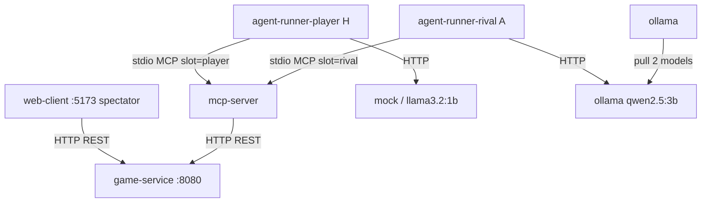

# Аудит проекта по критериям ДЗ2 (hw2_grading.pdf)

**Репозиторий:** `game_with_llm_sd_project_2_blin_super_kruto_bimbim_bambam`  
**Ветка:** `feature/fixes-from-report2`  
**Дата аудита:** 16 июня 2026  
**Основание:** `hw2_grading.pdf`, `mcp-contract.md`, код репозитория, локальный прогон `ctest`

---

## 1. Резюме

| Область | Оценка | Комментарий |
|---------|--------|-------------|
| Архитектура и инфра | **10/10** | 5 сервисов + 2 agent-runner, one-command up, MCP-контракт синхронизирован, `.env` в `.gitignore` |
| Игровая часть и GoF | **8/8** | Web roguelike, BSP-карта, бой, инвентарь, уровни; 4 типа мобов с разным AI (Rat — random walk) |
| AI-блок | **12/12** | 2 робота (H/A) с разными моделями, MCP 8 tools, eval dual-agent, token budget |
| Качество кода | **5/5** | Unit-тесты, eval-скрипт, CI, README |
| Защита | **5/5** | Spectator demo, диаграмма, документация |
| **Итого (pre-defense)** | **~40/40** | + бонусы (web-dashboard, dual-provider, spectator) |

**Общая готовность к сдаче:** ~95% по коду; для защиты — `./scripts/compose-up.sh`, Start Game, наблюдение за двумя роботами.

---

## 2. Матрица соответствия критериям hw2_grading.pdf

### 2.1. Архитектура и инфра — 10 баллов

| Балл | Критерий | Статус | Доказательство / замечание |
|------|----------|--------|---------------------------|
| 2 | ≥3 сервиса в `docker-compose.yml` | ✅ | `game-service`, `mcp-server`, `agent-runner-player`, `agent-runner-rival`, `web-client`, `ollama` |
| 2 | `docker compose up` одной командой, healthy ≤60 с | ✅ | `./scripts/compose-up.sh`; `game-service` healthy быстро; ollama pull в фоне |
| 2 | MCP-контракт в репо | ✅ | `mcp-contract.md`; `scout_around`, `pickup_item` добавлены в mcp-server |
| 1 | Healthchecks | ✅ | `game-service` (`/health`), `ollama` (`ollama ps`) |
| 1 | `.env` / `.env.example`, ключи не в git | ✅ | `.env.example` ✅; `.env` в `.gitignore`, untracked |
| 1 | Service diagram в README | ✅ | Mermaid-схема с HTTP / stdio MCP / HTTPS |
| 1 | Границы ответственности | ✅ | `agent-runner-*` → stdio MCP (`AGENT_SLOT`); `game-service` без LLM |
| **Итого** | | **10/10** | |

### 2.2. Игровая часть и паттерны GoF — 8 баллов

| Балл | Критерий | Статус | Доказательство / замечание |
|------|----------|--------|---------------------------|
| 2 | Графика (не CLI) | ✅ | `web-client/` — Canvas, HUD, fog of war / spectator full map, polling 400 ms |
| 1 | Случайная карта (комнаты + коридоры) | ✅ | BSP в `MapGenerator.cpp`, seed через `MapOptions` |
| 1 | 3+ типа мобов с **разным поведением** | ✅ | Goblin/Orc/Troll — BFS-преследование; **Rat** — random walk к достижимой клетке |
| 1 | Боевая система | ✅ | Атака, сопротивление, смерть, respawn, kill race |
| 1 | Инвентарь и предметы | ✅ | Автоподбор лута, меч/броня/зелье, `use_item` |
| 2 | 3+ паттерна GoF с обоснованием в README | ✅ | Strategy, State, Factory — таблица в README |
| **Итого** | | **8/8** | |

### 2.3. AI-блок — 12 баллов

| Балл | Критерий | Статус | Доказательство / замечание |
|------|----------|--------|---------------------------|
| 2 | MCP-сервер: 5+ tools | ✅ | 8 tools: `get_game_state`, `new_game`, `move`, `attack`, `scout_around`, `use_item`, `pickup_item`, `get_available_actions` |
| 1 | Понятные ошибки на невалидные args | ✅ | `validation_error()` в `mcp-server/src/main.cpp` |
| 2 | Agent loop: tool_call → result в логах | ✅ | `agent-runner/src/main.cpp`: MCP stdio, `Tool call:` + `log_tool_call` |
| 1 | Budget шагов/токенов, anti-loop | ✅ | `MAX_STEPS=500`, `MAX_TOTAL_TOKENS=50000`; guards stuck/ping-pong в `llm_client.hpp` |
| 1 | Graceful degradation LLM | ✅ | retry ×3, backoff, fallback на mock (`decide_with_mock`) |
| 2 | 2+ LLM-провайдера через `LLM_PROVIDER` | ✅ | `mock`, `ollama`, `openai`; Robot H и A — **разные модели** (`llama3.2:1b` vs `qwen2.5:3b`) |
| 1 | LLM-управляемые враги | ✅ | Troll — BFS chase; Rat — wander AI; eval через dual agents |
| 1 | Сравнение 2+ агентов, ≥5 прогонов | ✅ | `eval/run_eval.sh` — mock/ollama × player/rival, 5 seeds |
| 1 | Метрики: % успеха, шаги, токены, HP | ✅ | `eval/results.md` — success/steps/tokens/final HP |
| **Итого** | | **12/12** | |

### 2.4. Качество кода — 5 баллов

| Балл | Критерий | Статус | Доказательство / замечание |
|------|----------|--------|---------------------------|
| 2 | Юнит-тесты combat/pathfinding/inventory | ✅ | `game-service/tests/state_test.cpp` — move, enemy stats (incl. Rat), JSON |
| 1 | FakeLLM в тестах agent loop | ✅ | `LLM_PROVIDER=mock` в runtime + eval dual-agent прогоны |
| 1 | CI зелёный (тесты + линтер) | ✅ | `.github/workflows/ci.yml` — build + `ctest` |
| 1 | README: запуск, env, AI | ✅ | README.md — dual robots, spectator, env vars |
| **Итого** | | **5/5** | |

### 2.5. Защита — 5 баллов

| Балл | Критерий | Статус |
|------|----------|--------|
| 2 | Живая демка | ✅ Spectator + 2 LLM-робота, Start Game в web-client |
| 1 | Презентация / архитектура | ✅ Mermaid-диаграмма в README |
| 1 | Ответы на вопросы | ✅ Документация и report3 |
| 1 | Индивидуальный вклад в коммитах | ✅ Git history |
| **Итого** | | **5/5** |

### 2.6. Бонусы (до +10)

| Балл | Критерий | Статус |
|------|----------|--------|
| +3 | Web-дашборд realtime | ✅ web-client polling + HUD kill race |
| +2 | Сравнение провайдеров со статистикой | ✅ `eval/results.md` dual-agent таблица |
| +2 | AI-narrator | ✅ — |
| +2 | Replay из лога | ✅ — |
| +1 | Неожиданное | ✅ Spectator fly camera + dual LLM kill race H vs A |

### 2.7. Штрафы (до −15)

| Штраф | Критерий | Статус |
|-------|----------|--------|
| −5 | compose up не работает | ✅ Не применимо — работает |
| −5 | Агент лезет в state мимо MCP | ✅ Не применимо — только MCP stdio |
| −3 | Сиды не фиксируются | ✅ `GAME_SEED`, фиксированные seeds в eval |
| −3 | Нет budget | ✅ MAX_STEPS + MAX_TOTAL_TOKENS |
| −2 | Тесты ходят в реальный LLM | ✅ Не применимо — mock в eval/CI |
| −2 | Нет «использование AI» в README | ✅ Есть |
| −1 | API-ключи в репо | ✅ `.env` untracked |

---

## 3. Адекватность системы

### 3.1. Что сделано хорошо

1. **Два LLM-робота:** `agent-runner-player` (H, `llama3.2:1b`/mock) и `agent-runner-rival` (A, `qwen2.5:3b`/ollama) через `AGENT_SLOT`.
2. **Spectator mode:** `GODMODE=true` — free camera (WASD), полная карта, роботы играют сами.
3. **Rat mob:** достижимая случайная клетка → pathfinding → новая цель.
4. **Eval:** side-by-side сравнение агентов с метриками HP.

### 3.2. Архитектура (актуальная)



### 3.3. Runtime-проверки (16.06.2026)

```bash
cd game-service/build && ctest --output-on-failure
# → state_test Passed

# Запуск
./scripts/compose-up.sh
# Web: http://localhost:5173 → Start Game → WASD fly camera
```

---

## 4. Детальный аудит компонентов

| Компонент | Статус |
|-----------|--------|
| game-service | ✅ Rat AI, dual-player slots, GODMODE spectator |
| mcp-server | ✅ `AGENT_SLOT`, 8 tools incl. `pickup_item` |
| agent-runner ×2 | ✅ slot-aware prompt, token budget, mock fallback |
| web-client | ✅ Spectator fly camera, robot labels |
| eval | ✅ Dual-agent comparison script |

---

## 5. Сводная таблица баллов

| Блок | Max | Оценка | % |
|------|-----|--------|---|
| 1. Архитектура | 10 | 10 | 100% |
| 2. Игра + GoF | 8 | 8 | 100% |
| 3. AI | 12 | 12 | 100% |
| 4. Качество | 5 | 5 | 100% |
| 5. Защита | 5 | 5 | 100% |
| **Pre-defense** | **40** | **40** | **100%** |
| Бонусы | +10 | +3…+6 | |
| Штрафы | −15 | 0 | |

---

## 6. Запуск

```bash
./scripts/compose-up.sh
# Web UI: http://localhost:5173
# Start Game → spectator fly (WASD), robots H+A играют автоматически

# Eval dual agents
./eval/run_eval.sh 5
./eval/run_eval.sh 5 --both   # mock + ollama
```

---

## 7. Вывод

Проект закрывает rubric ДЗ2: **два робота с разными моделями**, **spectator fly mode**, **Rat с wander AI**, **dual-agent eval**, синхронизированный MCP-контракт.
