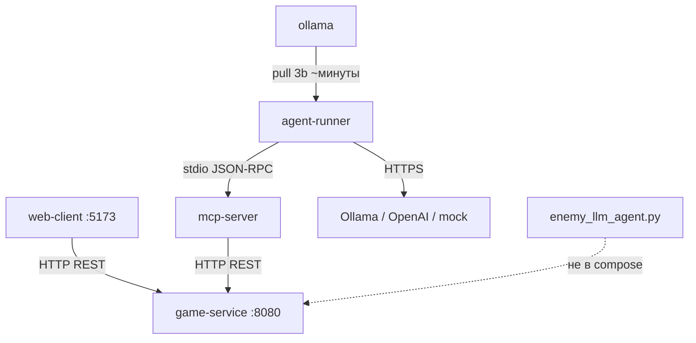

# Аудит проекта по критериям ДЗ2 (hw2_grading.pdf)

**Репозиторий:** `game_with_llm_sd_project_2_blin_super_kruto_bimbim_bambam`  
**Ветка:** `feature/fixes-from-report2`  
**Дата аудита:** 15 июня 2026  
**Основание:** `hw2_grading.pdf`, `mcp-contract.md`, код репозитория, локальный прогон `ctest`

---

## 1. Резюме

| Область | Оценка | Комментарий |
|---------|--------|-------------|
| Архитектура и инфра | **8.5/10** | 5 сервисов в compose, one-command up, MCP-контракт, healthchecks; `.env` в git |
| Игровая часть и GoF | **7.5/8** | Web roguelike, BSP-карта, бой, инвентарь, уровни; мобы различаются статами, не AI |
| AI-блок | **8/12** | MCP loop + 3 LLM-провайдера работают; eval и LLM-враги не доведены |
| Качество кода | **2.5/5** | Один unit-тест, CI без линтера, нет теста agent loop с FakeLLM |
| Защита | **?/5** | Зависит от live demo и ответов на вопросы |
| **Итого (pre-defense)** | **~26–29/40** | + до **+3** бонус (web-дашборд) − **−1…−2** штраф (`.env` в git) |

**Общая готовность к сдаче:** ~65–75% по коду; для уверенной сдачи (≥20 баллов) нужны eval с двумя агентами и доработка качества.

---

## 2. Матрица соответствия критериям hw2_grading.pdf

### 2.1. Архитектура и инфра — 10 баллов

| Балл | Критерий | Статус | Доказательство / замечание |
|------|----------|--------|---------------------------|
| 2 | ≥3 сервиса в `docker-compose.yml` | ✅ | `game-service`, `mcp-server`, `agent-runner`, `web-client`, `ollama` |
| 2 | `docker compose up` одной командой, healthy ≤60 с | ⚠️ | `./scripts/compose-up.sh` поднимает всё; `game-service` healthy быстро; `ollama` — `start_period: 300s`, первый pull модели дольше 60 с |
| 2 | MCP-контракт в репо | ⚠️ | `mcp-contract.md` есть, схемы и примеры; **расхождение**: в сервере `scout_around`, в контракте `get_visible_cells`; `pickup_item` в контракте, но **нет MCP-tool** |
| 1 | Healthchecks | ✅ | `game-service` (`/health`), `ollama` (`ollama ps`) |
| 1 | `.env` / `.env.example`, ключи не в git | ❌ | `.env.example` ✅; **`.env` tracked в git** (`git ls-files .env`) — риск штрафа −1 |
| 1 | Service diagram в README | ✅ | Mermaid-схема с HTTP / stdio MCP / HTTPS |
| 1 | Границы ответственности | ✅ | `agent-runner` → stdio MCP (`mcp_client.hpp`); `game-service` без LLM |
| **Итого** | | **~8.5/10** | |

### 2.2. Игровая часть и паттерны GoF — 8 баллов

| Балл | Критерий | Статус | Доказательство / замечание |
|------|----------|--------|---------------------------|
| 2 | Графика (не CLI) | ✅ | `web-client/` — Canvas, HUD, fog of war, polling 400 ms |
| 1 | Случайная карта (комнаты + коридоры) | ✅ | BSP в `MapGenerator.cpp`, seed через `MapOptions` |
| 1 | 3+ типа мобов с **разным поведением** | ⚠️ | Goblin/Orc/Troll — разные HP/урон (`enemy_stats_for`); **AI одинаковый** — BFS-преследование в `process_enemy_turns()` |
| 1 | Боевая система | ✅ | Атака, сопротивление, смерть, respawn, kill race |
| 1 | Инвентарь и предметы | ✅ | Автоподбор лута, меч/броня/зелье, `use_item` |
| 2 | 3+ паттерна GoF с обоснованием в README | ✅ | Strategy, State, Factory — таблица в README |
| **Итого** | | **~7.5/8** | |

### 2.3. AI-блок — 12 баллов

| Балл | Критерий | Статус | Доказательство / замечание |
|------|----------|--------|---------------------------|
| 2 | MCP-сервер: 5+ tools | ✅ | 7 tools: `get_game_state`, `new_game`, `move`, `attack`, `scout_around`, `use_item`, `get_available_actions` |
| 1 | Понятные ошибки на невалидные args | ✅ | `validation_error()` в `mcp-server/src/main.cpp`, без segfault |
| 2 | Agent loop: tool_call → result в логах | ✅ | `agent-runner/src/main.cpp`: MCP stdio, `Tool call:` + `log_tool_call` |
| 1 | Budget шагов/токенов, anti-loop | ⚠️ | `MAX_STEPS=500` в compose; `MAX_TOKENS` ограничивает `num_predict` (до 64), **не суммарный бюджет сессии**; guards против stuck/ping-pong в `llm_client.hpp` |
| 1 | Graceful degradation LLM | ✅ | retry ×3, backoff, fallback на mock (`decide_with_mock`) |
| 2 | 2+ LLM-провайдера через `LLM_PROVIDER` | ✅ | `mock`, `ollama`, `openai` в `LLMClient::from_env()` |
| 1 | LLM-управляемые враги | ⚠️ | `examples/enemy_llm_agent.py` — troll через HTTP `/api/enemy/*`; **не в docker-compose**, не в основном игровом цикле |
| 1 | Сравнение 2+ агентов, ≥5 прогонов | ❌ | `eval/run_eval.sh` принимает **одного** агента; нет side-by-side mock vs ollama/openai |
| 1 | Метрики: % успеха, шаги, токены, HP | ⚠️ | `eval/results.md` — только success/steps/tokens; **0% success**, нет финального HP, eval-логи устарели |
| **Итого** | | **~8/12** | |

### 2.4. Качество кода — 5 баллов

| Балл | Критерий | Статус | Доказательство / замечание |
|------|----------|--------|---------------------------|
| 2 | Юнит-тесты combat/pathfinding/inventory | ⚠️ | `game-service/tests/state_test.cpp` — move, enemy stats, JSON; **нет** отдельных тестов боя/инвентаря/BFS |
| 1 | FakeLLM в тестах agent loop | ❌ | Mock есть в runtime (`LLM_PROVIDER=mock`), **нет** автотеста loop |
| 1 | CI зелёный (тесты + линтер) | ⚠️ | `.github/workflows/ci.yml` — build + `ctest`; **линтера нет** |
| 1 | README: запуск, env, AI | ✅ | Разделы добавлены/расширены (см. README.md) |
| **Итого** | | **~2.5/5** | |

### 2.5. Защита — 5 баллов

| Балл | Критерий | Статус |
|------|----------|--------|
| 2 | Живая демка | ⚠️ Зависит от прогона; stack поднимается, agent ждёт Start Game |
| 1 | Презентация / архитектура | ⚠️ Диаграмма в README есть |
| 1 | Ответы на вопросы | — |
| 1 | Индивидуальный вклад в коммитах | ⚠️ Проверить на защите |

### 2.6. Бонусы (до +10)

| Балл | Критерий | Статус |
|------|----------|--------|
| +3 | Web-дашборд realtime | ⚠️ **Частично** — web-client с polling и HUD; можно аргументировать на защите |
| +2 | Сравнение провайдеров со статистикой | ❌ |
| +2 | AI-narrator | ❌ |
| +2 | Replay из лога | ❌ |
| +1 | Неожиданное | ⚠️ GODMODE spectator, kill race H vs A |

### 2.7. Штрафы (до −15)

| Штраф | Критерий | Статус |
|-------|----------|--------|
| −5 | compose up не работает | ✅ Не применимо — работает |
| −5 | Агент лезет в state мимо MCP | ✅ Не применимо — только MCP stdio |
| −3 | Сиды не фиксируются | ✅ `GAME_SEED`, фиксированные seeds в eval |
| −3 | Нет budget | ⚠️ MAX_STEPS есть; token budget слабый |
| −2 | Тесты ходят в реальный LLM | ✅ Не применимо |
| −2 | Нет «использование AI» в README | ✅ Есть |
| −1 | API-ключи в репо | ⚠️ **`.env` в git** — проверить содержимое |

---

## 3. Адекватность системы

### 3.1. Что сделано хорошо

1. **Чёткая микросервисная схема:** web-client и agent-runner ходят только в game-service / MCP; LLM изолирован в agent-runner.
2. **Игровое ядро зрелое:** real-time два игрока (human `H` + LLM ally `A`), кампания с уровнями, kill race, fog of war, GODMODE для демо.
3. **AI-пайплайн собран:** fork MCP server, LLM tool-calling loop, path planner, combat/stuck guards, retry/fallback.
4. **Инфраструктура:** one-command `./scripts/compose-up.sh`, CI, базовый eval-скрипт.

### 3.2. Архитектурные риски



| Риск | Влияние | Severity |
|------|---------|----------|
| `mcp-contract.md` ≠ реальные tools (`scout_around`, нет `pickup_item`) | Путаница при инспекции MCP / защите | Medium |
| Eval не сравнивает агентов | −1 балл по rubric | High |
| LLM-враги только в `examples/`, не в stack | −0.5…−1 балл | Medium |
| Одинаковый AI у всех мобов | −0.5 балл «разное поведение» | Medium |
| `.env` в git | Штраф −1, утечка ключей | High |
| Ollama cold start | Demo может стартовать на mock до готовности модели | Medium |

### 3.3. Runtime-проверки (15.06.2026)

```bash
# game-service unit tests
cd game-service/build && ctest --output-on-failure
# → state_test Passed

# MCP tools (из кода)
# 7 tools в mcp-server/src/main.cpp

# agent-runner
# MCP stdio, без прямых HTTP к game-service (только Ollama/OpenAI)
```

**Eval-логи (`eval/logs/mock_seed_*.log`):** устарели — старый формат (`Player HP`, циклический move), не соответствуют текущему `main.cpp` (Rival/Human, kill race). `eval/results.md`: 0% success — **нужен перезапуск eval** на актуальном образе.

---

## 4. Детальный аудит компонентов

### 4.1. game-service

| Функция | Статус |
|---------|--------|
| BSP-генерация + seed | ✅ |
| REST API по контракту | ✅ |
| JSON: `game_over`, `phase`, `won`, `rival`, `session_id` | ✅ `State.cpp::to_json` |
| Real-time tick, enemy BFS | ✅ |
| Campaign levels (`level_complete`, `campaign_level`) | ✅ |
| Combat / inventory | ✅ |
| Unit test | ⚠️ один файл |

### 4.2. mcp-server

| Функция | Статус |
|---------|--------|
| JSON-RPC stdio | ✅ |
| HTTP proxy на game-service | ✅ |
| Валидация args | ✅ |
| 5+ tools | ✅ (7) |
| `pickup_item` tool | ❌ отсутствует (REST есть) |
| Контракт синхронизирован | ⚠️ частично |

### 4.3. agent-runner

| Функция | Статус |
|---------|--------|
| MCP stdio client | ✅ |
| LLM mock / ollama / openai | ✅ |
| Tool loop + logging | ✅ |
| Ждёт Start Game (не вызывает new_game) | ✅ |
| Re-loop после MAX_STEPS исправлен | ✅ `is_round_finished`, `last_played_session_id` |
| Суммарный token budget | ❌ |
| FakeLLM unit test | ❌ |

### 4.4. web-client

| Функция | Статус |
|---------|--------|
| Canvas + HUD + fog | ✅ |
| `isPlayable` / victory / level complete | ✅ |
| В docker-compose :5173 | ✅ |
| Realtime polling | ✅ (бонус dashboard) |

### 4.5. examples/enemy_llm_agent.py

| Функция | Статус |
|---------|--------|
| FakeLLM + OllamaLLM | ✅ |
| HTTP enemy API для troll | ✅ |
| Интеграция в compose / основную игру | ❌ |

---

## 5. Сводная таблица баллов (ориентир)

| Блок | Max | Оценка | % |
|------|-----|--------|---|
| 1. Архитектура | 10 | 8.5 | 85% |
| 2. Игра + GoF | 8 | 7.5 | 94% |
| 3. AI | 12 | 8 | 67% |
| 4. Качество | 5 | 2.5 | 50% |
| 5. Защита | 5 | ? | — |
| **Pre-defense** | **40** | **~26–29** | **~68%** |
| Бонусы | +10 | +0…+3 | |
| Штрафы | −15 | −0…−2 | |

*Реальная оценка преподавателя может отличаться.*

---

## 6. Приоритетный план до защиты

### P0 — закрыть обязательные пробелы rubric

1. **Убрать `.env` из git**, оставить только `.env.example`; добавить `.env` в `.gitignore`.
2. **Eval:** прогнать `./eval/run_eval.sh mock 5` и `./eval/run_eval.sh ollama 5`; расширить скрипт — **2 агента**, метрики HP в конце, обновить `eval/results.md`.
3. **Синхронизировать `mcp-contract.md`:** добавить `scout_around`, tool `pickup_item` в mcp-server (или явно пометить deprecated).

### P1 — укрепить demo

4. Запустить `enemy_llm_agent.py` в compose (sidecar) или встроить LLM-логику для troll в game-service tick.
5. Развести поведение мобов (goblin — быстрый слабый, orc — агрессия, troll — LLM / медленный).
6. Тест agent loop с `LLM_PROVIDER=mock` (gtest или pytest).
7. CI: добавить clang-format / eslint lint job.

### P2 — бонусы

8. Таблица сравнения провайдеров с CI в `eval/results.md`.
9. Replay из `AGENT_LOG_PATH` / `logs/logs.log`.

---

## 7. Вывод

Проект **существенно продвинулся** относительно `report2.md`: agent-runner работает через MCP, web-client в compose, три LLM-провайдера, валидация MCP, уровни кампании, CI и базовые тесты.

**Главные оставшиеся разрывы с hw2_grading.pdf:** сравнение двух агентов и полноценные метрики eval; LLM-враги вне основного stack; слабое покрытие тестами; `.env` в репозитории; расхождение MCP-контракта с кодом.

**Минимум для сдачи (20 баллов)** уже близок по архитектуре и игре; для **уверенных ~30+** нужны eval с двумя агентами и устранение штрафных рисков.
